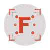

<div align="center">
  

# Ferrum 🌿

**A 3D rendering engine for plant biology exploration**

[](https://rustup.rs/)
[](https://wgpu.rs/)
[](https://astro.build/)
[](LICENSE)
[](https://vercel.com)

  <br/>

<a href="#features">Features</a> •
<a href="#live-demo">Live Demo</a> •
<a href="#getting-started">Getting Started</a> •
<a href="#architecture">Architecture</a> •
<a href="#license">License</a>

  <br/>
</div>

Ferrum is a 3D rendering engine built with **Rust** and **wgpu** (WebGPU) that lets you explore plant life through seamless transitions across scales — from external morphology down to the cellular and molecular level — all within a single interactive environment.

Developed as a final degree project, it combines a PBR rendering pipeline with a cross-platform architecture that runs on **desktop** (Windows, Linux, macOS), **browser** (WebAssembly), and **Raspberry Pi** with physical sensors.

---

## Features

- **PBR rendering** with diffuse/specular lighting, tangent-space normal mapping, HDR pipeline and ACES tonemapping
- **Skybox** from equirectangular HDR/EXR images processed with compute shaders
- **Animated directional light** with orbital rotation and shadow maps
- **Instancing** for efficient multi-object rendering
- **Free camera** with WASD / arrow key controls
- **Asynchronous resource loading** on both native and WASM targets
- **Interactive demo** with Raspberry Pi and physical sensors
- **Web visualization** via WebAssembly through WebGL
- **Stripe payment** integration for commercial licensing
- **WebSockets** for real-time sensor data streaming

---

## Live Demo

Try the engine directly from your browser on the [demo page](https://ferrum.dev/demo). The engine compiles to WebAssembly and runs inside a `<canvas>` element via wgpu on WebGL — no installation required.

### Raspberry Pi Demo

The demo connects a **Raspberry Pi** with the following sensors to simulate how the environment affects a plant:

| Component                  | Connection         | Purpose                                                                          |
| -------------------------- | ------------------ | -------------------------------------------------------------------------------- |
| **TSL2591**                | I2C (`/dev/i2c-1`) | Ambient light sensor — measures lux, full spectrum and infrared                  |
| **ADS1115**                | External ADC       | Analog-to-digital converter for the microphones                                  |
| **4× MAX446**              | ADC input pins     | Microphones that detect wind (blowing) and translate it into forces on the plant |
| **Wide Angle 120º Camera** | CSI                | Detects light direction to orient the scene illumination                         |

Sensor data is streamed to the rendering engine in real time via **WebSockets**, so real-world light and wind directly affect the plant in the 3D scene.

---

## Pricing

| Plan           | Price           | Includes                                                               |
| -------------- | --------------- | ---------------------------------------------------------------------- |
| **FREE**       | $0              | 3 active models, WebGL export, Discord community                       |
| **STUDIO**     | $100 (lifetime) | Unlimited models, WASM+WebGL export, VR/XR support, source code access |
| **ENTERPRISE** | Custom          | Multi-site licenses, 24/7 support, custom integrations                 |

Every user can upload their own 3D plant model to track its evolution inside the engine.

---

## Tech Stack

| Layer           | Technology                                                                   |
| --------------- | ---------------------------------------------------------------------------- |
| **Language**    | Rust (edition 2024)                                                          |
| **Graphics**    | [wgpu](https://wgpu.rs/) 0.28                                                |
| **Windowing**   | [winit](https://github.com/rust-windowing/winit) 0.30                        |
| **Shading**     | WGSL (PBR, HDR, skybox, equirectangular → cubemap)                           |
| **Math**        | cgmath 0.18                                                                  |
| **3D Models**   | Wavefront .obj (async loading via tobj)                                      |
| **Textures**    | PNG, JPEG, HDR, EXR, ICO                                                     |
| **Frontend**    | [Astro](https://astro.build/) 5 + [Tailwind CSS](https://tailwindcss.com/) 4 |
| **WebAssembly** | wasm-bindgen + wasm-pack                                                     |
| **Web assets**  | Cloudflare R2                                                                |
| **Pi sensors**  | linux-embedded-hal + tsl2591-rs (I2C)                                        |
| **Build tools** | Cargo xtask                                                                  |
| **Deploy**      | Vercel                                                                       |
| **Payments**    | Stripe                                                                       |

### Graphics Backends

| Platform                | wgpu Backend                            |
| ----------------------- | --------------------------------------- |
| Windows / macOS / Linux | Vulkan, Metal, DX12                     |
| Web (WASM)              | WebGL + WebGPU (on compatible browsers) |
| Raspberry Pi            | OpenGL ES                               |

---

## Getting Started

### Prerequisites

- [Rust](https://rustup.rs/) — `rustup update`
- [wasm-pack](https://rustwasm.github.io/wasm-pack/) — `cargo install wasm-pack`
- [Node.js](https://nodejs.org/) 18+
- For Raspberry Pi: [`cross`](https://github.com/cross-rs/cross) and `aarch64-unknown-linux-gnu` toolchain

### Desktop

```bash
cargo run -p engine
```

### Web (WASM)

```bash
cargo xtask web
```

Compiles the engine to WebAssembly and outputs it to `www/public/pkg/` for the demo page.

### Frontend (dev server)

```bash
cd www && npm install && npm run dev
```

### Raspberry Pi

```bash
export PI_USER="pi"
export PI_HOST="192.168.1.x"
cargo xtask rpi
```

Cross-compiles with `cross`, deploys via SCP, and runs the binary on the Raspberry Pi.

### Deploy web

```bash
cargo xtask vercel-deploy
```

### All together (Pi + desktop)

```bash
cargo xtask run
```

---

## Architecture

```
ferrum/
├── Cargo.toml                     # Workspace root
├── .cargo/config.toml             # Aliases and aarch64 linker
├── .env.example                   # Raspberry Pi configuration
│
├── crates/
│   ├── engine/                    # 3D rendering engine
│   │   ├── Cargo.toml             # wgpu, winit, cgmath, tobj, image, bytemuck
│   │   ├── build.rs               # Copies resources to build directory
│   │   ├── assets/                # logo.png, logo.ico
│   │   ├── res/                   # 3D models and textures
│   │   │   ├── plant/             # Potted plant (.obj + diffuse + normal)
│   │   │   ├── floor/             # Floor (.obj + texture)
│   │   │   └── sun/               # Venus sphere (light source representation)
│   │   └── src/
│   │       ├── main.rs            # Entry point
│   │       ├── lib.rs             # State, App, run(), WASM bootstrap
│   │       ├── camera.rs          # Camera, uniforms, WASD controller
│   │       ├── hdr.rs             # HDR pipeline and equirect→cubemap loader
│   │       ├── light.rs           # Light uniform and render pipeline
│   │       ├── material.rs        # Material with diffuse + normal textures
│   │       ├── models.rs          # Vertex, Model, Mesh, Instance, draw traits
│   │       ├── pipeline.rs        # Render pipeline factory
│   │       ├── resources.rs       # Async resource loader (native + WASM + R2)
│   │       ├── structs.rs         # Shared data structures
│   │       ├── texture.rs         # 2D, depth, cube, and shadow map textures
│   │       └── shaders/           # WGSL shaders
│   │           ├── shaders.wgsl           # PBR vertex/fragment
│   │           ├── sky.wgsl               # Skybox (fullscreen triangle)
│   │           ├── light.wgsl             # Light source rendering
│   │           ├── hdr.wgsl               # ACES tonemapping
│   │           ├── equirectangular.wgsl   # Equirect→cubemap compute shader
│   │           └── pure-sky.wgsl          # Alternative sky shader
│   │
│   ├── rpi/                       # Raspberry Pi sensor reader
│   │   ├── Cargo.toml             # linux-embedded-hal, tsl2591-rs
│   │   └── src/main.rs            # I2C → TSL2591
│   │
│   └── xtask/                     # Build automation
│       ├── Cargo.toml             # colored, dotenvy
│       └── src/main.rs            # Commands: web, rpi, vercel-deploy, run
│
└── www/                           # Web frontend
    ├── astro.config.mjs           # Vite + Tailwind CSS
    ├── package.json               # astro, tailwindcss, sonner, toastify-js
    ├── tsconfig.json              # Strict TypeScript
    ├── public/
    │   ├── img/                   # Site images
    │   ├── logo/                  # Favicon
    │   └── pkg/                   # Compiled WASM module
    └── src/
        ├── layouts/Layout.astro
        ├── pages/
        │   ├── index.astro        # Landing page
        │   ├── demo.astro         # Interactive WASM demo
        │   └── download.astro     # Pricing / licenses
        ├── components/            # 10 Astro components
        ├── assets/icons/          # 12 SVG icons
        └── styles/global.css      # Theme and Tailwind
```

---

## License

**GNU General Public License v3.0** — see [LICENSE](LICENSE).

---

<div align="center">
  <sub>Built as a Bachelor's Thesis project</sub>
</div>
